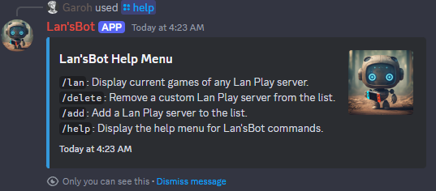
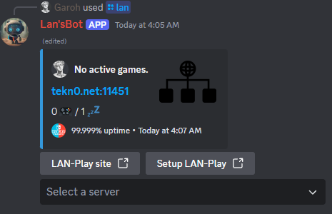
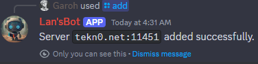
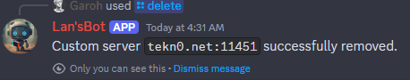

<div align="center">

# 🎮 LanPlay-DiscordBot


[](https://github.com/LeGeRyChEeSe/LanPlay-DiscordBot)
[](https://github.com/LeGeRyChEeSe/LanPlay-DiscordBot/stargazers)
[](https://github.com/LeGeRyChEeSe/LanPlay-DiscordBot/issues)
[](https://python.org)
[](https://docker.com)
[](LICENSE)

**🎮 Modern Discord bot for real-time LAN Play server monitoring**

_Monitor Nintendo Switch games, players, and servers across multiple LAN Play instances with beautiful Discord integration_

[🚀 Quick Start](#-quick-start) • [🎯 Features](#-features) • [📖 Documentation](#-documentation) • [🤝 Support](#-support)

</div>

## 🚀 Quick Start

### 🔥 Docker Installation (Recommended)

**✨ Quick start with Docker Compose:**

```bash
git clone https://github.com/LeGeRyChEeSe/LanPlay-DiscordBot.git
cd LanPlay-DiscordBot
cp .env.example .env
```

**⚠️ IMPORTANT: Configure your .env file before starting:**
```bash
# Edit .env with a text editor and add your tokens:
# TOKEN=your_discord_bot_token_here
# API_LAN_KEY=your_lan_play_api_key_here
```

```bash
docker-compose up -d
```

### 📋 Installation Steps

1. **Clone the repository** from GitHub
2. **Copy the environment template**: `cp .env.example .env`
3. **⚠️ Configure your API keys** in the `.env` file:
   - **Discord Bot Token**: Get from [Discord Developer Portal](https://discord.com/developers/applications)
   - **LAN Play API Key**: Get from [lan-play.com](http://lan-play.com) (see [guide](#getting-api-key))
4. **Start the bot** with Docker or Python

> **📚 Need help?** [View detailed setup guide](#-discord-bot-setup)

## 🎯 Features

### 🛠️ What You Get

#### 🌟 Core Components
- 🎮 **Real-time Game Monitoring**: Display active Nintendo Switch games and player counts
- 🌐 **Multi-Server Support**: Monitor multiple LAN Play servers simultaneously
- 🔧 **Custom Server Management**: Administrators can add/remove custom servers

#### 🎲 Additional Features
- 🌍 **Multi-language Support**: Available in English and French
- 📊 **Server Uptime Tracking**: Display server reliability information
- 🎨 **Rich Embeds**: Beautiful Discord embeds with game icons and player information

### ✨ Smart Features
- 🐳 **Docker Ready**: Fully containerized for easy deployment
- 🔒 **Security First**: Non-root Docker containers and input validation

## 📖 Documentation

**Quick Links:**
- [Discord Bot Setup Guide](#-discord-bot-setup)
- [Configuration Guide](#️-configuration)
- [Commands Reference](#-commands)
- [Project Structure](#-project-structure)

### 🔧 Installation Methods

#### 🐳 Docker (Recommended)

**Using Docker Compose:**
```bash
# 1. Clone and navigate
git clone https://github.com/LeGeRyChEeSe/LanPlay-DiscordBot.git
cd LanPlay-DiscordBot

# 2. Create environment file
cp .env.example .env

# 3. ⚠️ EDIT .env file with your tokens:
# TOKEN=your_discord_bot_token_here
# API_LAN_KEY=your_lan_play_api_key_here

# 4. Start the bot
docker-compose up -d
```

**Using Docker Run:**
```bash
docker run -d \
  --name lanplay-discordbot \
  -e TOKEN=your_discord_bot_token_here \
  -e API_LAN_KEY=your_lan_play_api_key_here \
  -v bot_data:/app/data \
  garohrl/lanplay-discordbot:latest
```

#### 🛠️ Manual Installation

```bash
# 1. Clone and navigate
git clone https://github.com/LeGeRyChEeSe/LanPlay-DiscordBot.git
cd LanPlay-DiscordBot

# 2. Create virtual environment
python -m venv venv
source venv/bin/activate  # Windows: venv\Scripts\activate

# 3. Install dependencies
pip install -r requirements.txt

# 4. Create environment file
cp .env.example .env

# 5. ⚠️ EDIT .env file with your API keys:
# TOKEN=your_discord_bot_token_here
# API_LAN_KEY=your_lan_play_api_key_here

# 6. Start the bot
python main.py
```

## ⚙️ Configuration

### Environment Variables

Create a `.env` file with the following variables:

```env
# Discord Bot Token (Required)
TOKEN=your_discord_bot_token

# LAN Play API Key (Required)
API_LAN_KEY=your_lan_play_api_key
```

### Getting API Key

**📋 Step-by-step guide to get your LAN Play API key:**

1. **Visit** [lan-play.com](http://www.lan-play.com)
2. **Open Developer Tools** (`F12` or `Ctrl+Shift+I`)
3. **Go to Network tab** and refresh the page
4. **Find the `getMonitors` request** and click on it
5. **In the Payload tab**, copy the `api_key` value
6. **Add it to your .env file**: `API_LAN_KEY=your_copied_api_key_here`

> ⚠️ **Important**: Without a valid API key, the bot cannot fetch LAN Play server data!

## 📱 Discord Bot Setup

### Creating a Discord Application

1. Go to the [Discord Developer Portal](https://discord.com/developers/applications)
2. Click **"New Application"** and give it a name
3. Navigate to the **"Bot"** section
4. Click **"Add Bot"** and confirm
5. Copy the bot token and add it to your `.env` file

### Bot Permissions

The bot requires the following permissions:
- `Send Messages`
- `Send Messages in Threads` 
- `Embed Links`
- `Read Message History`
- `Manage Expressions` (for game icons)
- `Create Expressions`
- `Use Slash Commands`

### Inviting the Bot

1. In the Discord Developer Portal, go to **OAuth2 → URL Generator**
2. Select these scopes:
   - `bot`
   - `applications.commands`
3. Select the permissions listed above
4. Use the generated URL to invite the bot to your server

> ⚠️ **Security Note**: Keep your bot token secret! Never share it publicly or commit it to version control.

## 🎮 Commands

| Command | Description | Usage | Permission | Preview |
|---------|-------------|-------|------------|---------|
| `/help` | Display help menu and available commands | `/help` | Everyone |  |
| `/lan` | Display LAN Play server information and active games | `/lan` | Everyone |  |
| `/add` | Add a custom LAN Play server to monitoring | `/add server:tekn0.net:11451` | Administrator |  |
| `/delete` | Remove a custom LAN Play server | `/delete server:tekn0.net:11451` | Administrator |  |
| `/version` | Display bot version and build information | `/version` | Everyone | - |
| `/changelog` | Show recent changes and release notes | `/changelog [count:5]` | Everyone | - |

### Command Examples

#### `/lan` Command
Shows server selection menu with:
- Server uptime percentages
- Real-time player counts (active/idle)
- Game information with custom icons
- Host and player details

#### Admin Commands
- **Add Server**: `/add server:your-server.com:11451`
- **Delete Server**: `/delete server:your-server.com:11451` (with autocomplete)

## 📁 Project Structure

```
LanPlay-DiscordBot/
├── src/
│   ├── bot/
│   │   ├── bot.py          # Main bot class and initialization
│   │   ├── commands.py     # Slash command handlers
│   │   └── events.py       # Event handlers (dropdowns, etc.)
│   ├── utils/
│   │   ├── lanplay_client.py    # GraphQL client for LAN Play API
│   │   ├── server_manager.py    # Custom server management
│   │   ├── localization.py      # Multi-language support
│   │   ├── version.py           # Semantic versioning system
│   │   └── changelog.py         # Changelog management
│   └── config/
│       ├── settings.py     # Configuration management
│       └── locale/         # Language files
├── scripts/                # Development and build scripts
│   ├── version_bump.py     # Python version management
│   ├── version.sh          # Shell version commands
│   └── docker-build.sh     # Docker build with versioning
├── static/assets/          # Static resources
├── tests/                  # Unit tests
├── main.py                 # Application entry point
├── requirements.txt        # Python dependencies
├── Dockerfile             # Container configuration
├── docker-compose.yml     # Docker Compose setup
├── Makefile                # Development commands
├── VERSION                 # Current version number
├── CHANGELOG.md            # Structured changelog
├── VERSIONING.md           # Versioning system documentation
└── .env.example           # Environment template
```

## 🤝 Support

### 🐛 Having Issues?
- [Troubleshooting Guide](#-configuration)
- [Report an Issue](https://github.com/LeGeRyChEeSe/LanPlay-DiscordBot/issues)

### 🌐 Official Resources
- [LAN Play Website](http://lan-play.com)
- [Discord Developer Portal](https://discord.com/developers/applications)

### 🔄 Development

**Running Tests:**
```bash
python -m pytest tests/
```

**Code Formatting:**
```bash
black src/
flake8 src/
```

**Development Setup:**
1. Fork the project
2. Create feature branch: `git checkout -b feature/AmazingFeature`
3. Install dependencies: `pip install -r requirements.txt`
4. Make changes and test
5. Document changes: `make add-change TYPE=added DESC="New feature"`
6. Commit: `git commit -m 'feat: Add AmazingFeature'`
7. Release: `make release-bump TYPE=minor` (if needed)
8. Push and create Pull Request

**Version Management:**
```bash
# Show current version
make version

# Add changelog entry
make add-change TYPE=fixed DESC="Fix bug" ISSUE="#42"

# Version bumping
make bump-patch    # Bug fixes
make bump-minor    # New features  
make bump-major    # Breaking changes

# Release management
make release       # Release unreleased changes
make changelog     # View recent changes
```

## 📝 License & Credits

**📄 Licensed under [MIT License](LICENSE)**

### 🙏 Special Thanks
- [LAN Play Community](http://lan-play.com) for the amazing service
- [Discord.py](https://github.com/Rapptz/discord.py) developers
- All [contributors](https://github.com/LeGeRyChEeSe/LanPlay-DiscordBot/graphs/contributors) who helped improve this project

## 📈 Star History

[](https://star-history.com/#LeGeRyChEeSe/LanPlay-DiscordBot&Date)

**👨‍💻 Author**: [Garoh](https://github.com/LeGeRyChEeSe/) • **Discord**: garohrl